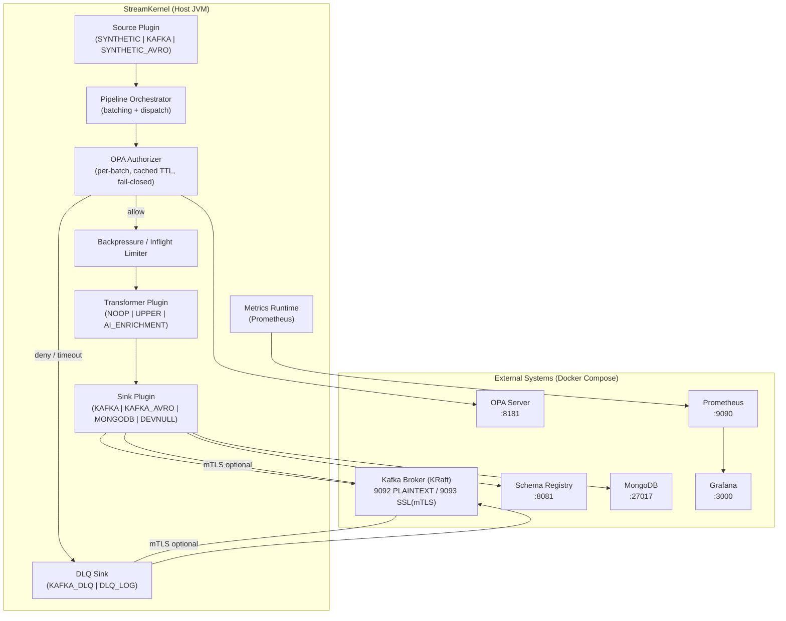

## 🏗 Architecture

StreamKernel follows a "Kernel + Plugin" architecture. The Kernel manages the thread lifecycle, while Plugins handle the I/O.

```mermaid
graph TD
  subgraph SK["StreamKernel (Host JVM)"]
    SRC["Source Plugin<br/>(SYNTHETIC | KAFKA | SYNTHETIC_AVRO)"]
    ORCH["Pipeline Orchestrator<br/>(batching + dispatch)"]
    AUTH["OPA Authorizer<br/>(per-batch, cached TTL, fail-closed)"]
    BP["Backpressure / Inflight Limiter"]
    XFORM["Transformer Plugin<br/>(NOOP | UPPER | AI_ENRICHMENT)"]
    SINK["Sink Plugin<br/>(KAFKA | KAFKA_AVRO | MONGODB | DEVNULL)"]
    DLQ["DLQ Sink<br/>(KAFKA_DLQ | DLQ_LOG)"]
    MET["Metrics Runtime<br/>(Prometheus)"]
  end

  subgraph EXT["External Systems (Docker Compose)"]
    KAFKA["Kafka Broker (KRaft)<br/>9092 PLAINTEXT / 9093 SSL(mTLS)"]
    OPA["OPA Server<br/>:8181"]
    SR["Schema Registry<br/>:8081"]
    MDB["MongoDB<br/>:27017"]
    PROM["Prometheus<br/>:9090"]
    GRAF["Grafana<br/>:3000"]
  end

  SRC --> ORCH
  ORCH --> AUTH
  AUTH -->|allow| BP --> XFORM --> SINK
  AUTH -->|deny / timeout| DLQ

  AUTH --> OPA
  SINK --> KAFKA
  DLQ --> KAFKA
  SINK --> SR
  SINK --> MDB

  MET --> PROM --> GRAF

  KAFKA ---|mTLS optional| SINK
  KAFKA ---|mTLS optional| DLQ

```

---
Source → Transform → Sink
↓
OPA
↓
DLQ
---