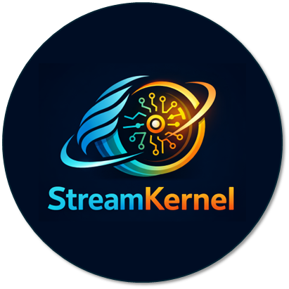
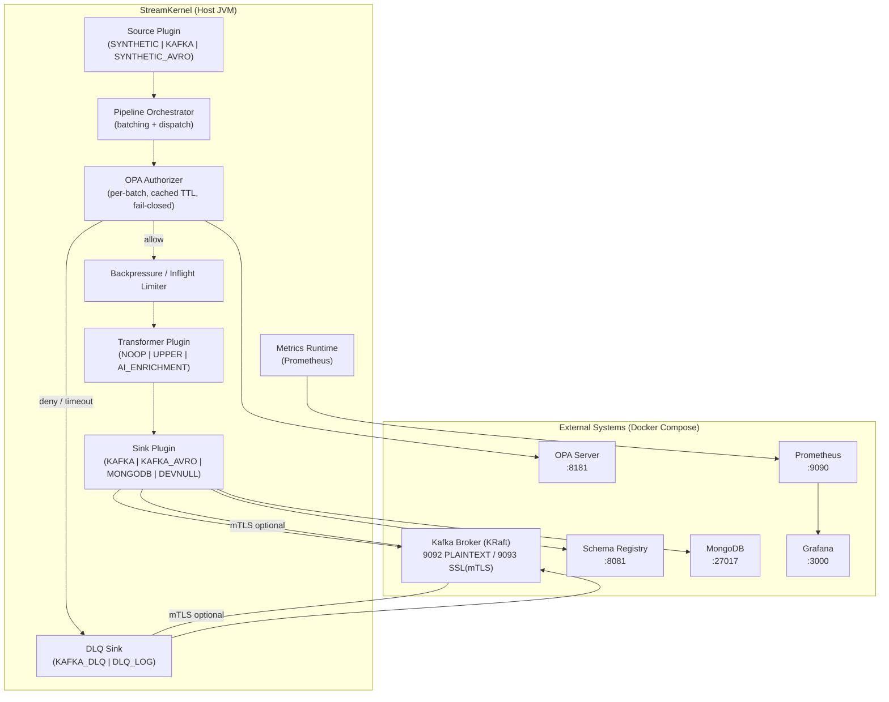

# StreamKernel





**StreamKernel** is a high-performance, enterprise-grade event orchestration engine designed to bridge the gap between low-latency data movement and intelligent data enrichment.

Created and maintained by **Steven Lopez**, this framework utilizes **Java 21 Virtual Threads** and **ZGC** to serve as a lightweight, modular "kernel" for streaming data—handling concurrency, backpressure, and error resilience while delegating business logic to pluggable components.

---

## 🚀 Key Features

### Core Architecture
* **Virtual Thread Orchestrator:** Uses Java 21's `newVirtualThreadPerTaskExecutor` to handle thousands of concurrent pipelines with minimal footprint.
* **Adaptive Backpressure:** Internal semaphore-based flow control that pauses ingestion when downstream sinks are saturated.
* **SPI Plugin System:** Fully modular design. Source, Sink, and Transform logic are loaded dynamically at runtime using Java's Service Provider Interface (SPI).

### Enterprise Reliability
* **Schema Enforcement:** First-class support for **Avro** and **Schema Registry** to prevent "data trash" in downstream systems.
* **Resilience:** Configurable **Dead Letter Queues (DLQ)** and "Stop-the-World" safe shutdown mechanisms ensuring zero data loss during restarts.
* **Observability:** Built-in **Prometheus** metrics endpoint tracking throughput, latency, and cache hit rates.

### Modern Intelligence
* **AI-Ready:** Includes transformers for **Vector Embedding** generation (RAG support).
* **Polyglot Storage:** Drivers for **Kafka**, **MongoDB (Vector Search)**, and generic HTTP endpoints.

---

## 🏗 Architecture

StreamKernel follows a "Kernel + Plugin" architecture. The Kernel manages the thread lifecycle, while Plugins handle the I/O.



---
Source → Transform → Sink
↓
OPA
↓
DLQ
---

# StreamKernel — Local Test Playbooks

This repo contains step-by-step, copy/paste playbooks for validating StreamKernel’s major capabilities:

- Kafka bench runs (SYNTHETIC ring-buffer source)
- mTLS (SSL) connectivity to Kafka
- Open Policy Agent (OPA) topic-level authorization
- DLQ strategies (LOG + Kafka DLQ topic, with serializer)
- Prometheus + Grafana dashboards
- Schema Registry + Avro sink/source validation
- MongoDB Vector sink validation
- Transformer validation

## Folder Structure

- `docs/` — individual playbooks, one capability per file
- `docs/_common.md` — shared prerequisites and conventions

## Quick Start

1. Start infrastructure:
```bash
docker compose up -d
docker compose ps
```

2. Create topics (bootstrap inside the container):
```bash
docker exec -it arena-broker kafka-topics --bootstrap-server broker:29092 --create --if-not-exists --topic arena-bench-test --partitions 6 --replication-factor 1 --config max.message.bytes=10485760
docker exec -it arena-broker kafka-topics --bootstrap-server broker:29092 --create --if-not-exists --topic streamkernel-dlq --partitions 6 --replication-factor 1
```

3. Build and run StreamKernel:
```bash
./gradlew clean build -x test
java -Xms4g -Xmx4g -XX:+UseZGC -XX:+ZGenerational -jar .\build\libs\StreamKernel-0.0.1-SNAPSHOT-all.jar
```

---

Then follow the specific playbooks in `docs/`.

## Recommended Run Order

1. `docs/01_synthetic_kafka_bench.md`
2. `docs/02_opa_authorization.md`
3. `docs/03_mtls_ssl.md`
4. `docs/04_dlq.md`
5. `docs/05_prometheus_grafana.md`
6. `docs/06_transforms.md`
7. `docs/07_schema_registry_avro.md`
8. `docs/08_mongodb_vector_sink.md`

---

## Configuration Profiles (config/profiles)

| Profile | Purpose | Security | Kafka | OPA | DLQ | Observability |
|------|--------|---------|------|-----|-----|--------------|
| `01-synthetic-bench.properties` | Max throughput benchmark | ❌ | PLAINTEXT | ❌ | ❌ | ✅ |
| `02-opa-secure.properties` | Authorization testing | ❌ | PLAINTEXT | ✅ | ❌ | ✅ |
| `03-mtls-kafka.properties` | mTLS validation | ✅ | SSL | ❌ | ❌ | ✅ |
| `04-dlq-durable.properties` | Failure handling | ❌ | PLAINTEXT | ❌ | ✅ | ✅ |
| `05-avro-schema.properties` | Schema Registry / Avro | ❌ | PLAINTEXT | ❌ | ❌ | ❌ |
| `06-mongodb-vector.properties` | MongoDB Vector sink | ❌ | N/A | ❌ | ❌ | ❌ |
| `07-transforms.properties` | Transform validation | ❌ | DEVNULL | ❌ | ❌ | ❌ |
| `08-full-enterprise.properties` | Production-grade pipeline | ✅ | SSL | ✅ | ✅ | ✅ |

---

## 🗺 Roadmap

### Phase 1: Security Hardening (Completed 12/23/2025)
* [x] **mTLS Encryption:** Enforce strict mutual TLS between the Kernel and Kafka brokers.
* [x] **RBAC:** Integration with Open Policy Agent (OPA) for topic-level authorization.

### Phase 2: Cloud Native
* [ ] **Kubernetes Support:** Helm charts for deploying StreamKernel as a scalable `Deployment`.
* [ ] **Istio Integration:** Service Mesh sidecar injection for zero-trust networking.
* [ ] **Operator Pattern:** Custom Resource Definition (CRD) to manage pipelines via `kubectl apply -f pipeline.yaml`.

---

## 📜 License

This project is licensed under the MIT License - see the [LICENSE](LICENSE) file for details.

**Author:** Steven Lopez
