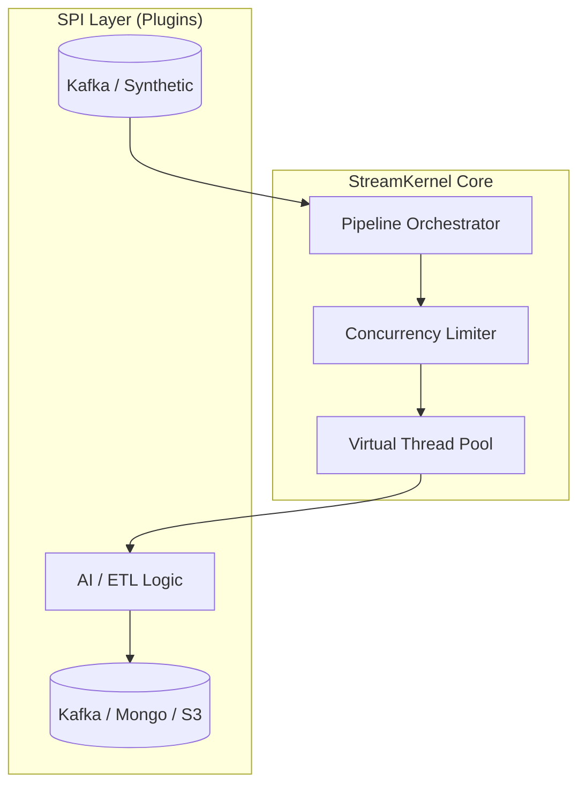

# StreamKernel


**StreamKernel** is a high-performance, enterprise-grade event orchestration engine designed to bridge the gap between low-latency data movement and intelligent data enrichment.

Created and maintained by **Steven Lopez**, this framework utilizes **Java 21 Virtual Threads** and **ZGC** to serve as a lightweight, modular "kernel" for streaming data—handling concurrency, backpressure, and error resilience while delegating business logic to pluggable components.

---

## 🚀 Key Features

### Core Architecture
* **Virtual Thread Orchestrator:** Uses Java 21's `newVirtualThreadPerTaskExecutor` to handle thousands of concurrent pipelines with minimal footprint.
* **Adaptive Backpressure:** Internal semaphore-based flow control that pauses ingestion when downstream sinks are saturated.
* **SPI Plugin System:** Fully modular design. Source, Sink, and Transform logic are loaded dynamically at runtime using Java's Service Provider Interface (SPI).

### Enterprise Reliability
* **Schema Enforcement:** First-class support for **Avro** and **Schema Registry** to prevent "data trash" in downstream systems.
* **Resilience:** Configurable **Dead Letter Queues (DLQ)** and "Stop-the-World" safe shutdown mechanisms ensuring zero data loss during restarts.
* **Observability:** Built-in **Prometheus** metrics endpoint tracking throughput, latency, and cache hit rates.

### Modern Intelligence
* **AI-Ready:** Includes transformers for **Vector Embedding** generation (RAG support).
* **Polyglot Storage:** Drivers for **Kafka**, **MongoDB (Vector Search)**, and generic HTTP endpoints.

---

## 🏗 Architecture

StreamKernel follows a "Kernel + Plugin" architecture. The Kernel manages the thread lifecycle, while Plugins handle the I/O.



---

## ⚡ Quick Start (Local)

This profile is tuned for maximum throughput on a local developer machine using Docker for infrastructure and the host machine for the kernel.

### Prerequisites
* Java 21+
* Docker & Docker Compose

### 1. Start Infrastructure
Launch Kafka, Zookeeper, Schema Registry, and MongoDB.
```bash
docker-compose up -d
```

### 2. Prepare Topics
Create the benchmark topic with settings optimized for high throughput.
```bash
docker exec stream-broker kafka-topics \
  --bootstrap-server localhost:9092 \
  --create \
  --topic arena-bench-test \
  --partitions 6 \
  --replication-factor 1 \
  --config max.message.bytes=10485760
```

### 3. Build the Kernel
Skip tests for a rapid build iteration.
```bash
./gradlew clean build -x test
```

### 4. Run (High Performance Mode)
We use the **Z Garbage Collector (ZGC)** to maintain sub-millisecond pause times even under heavy heap pressure (4GB+).

```bash
java -Xms4g -Xmx4g \
     -XX:+UseZGC -XX:+ZGenerational \
     -jar build/libs/StreamKernel-1.0.0-SNAPSHOT.jar
```

---

## 🔌 Configuration

The kernel is configured via `pipeline.properties`.

**Key Profiles:**
* **`pipeline.properties` (Default):** Uses Synthetic data sources and a DevNull sink for raw throughput testing (100k+ msg/sec).
* **`pipeline-enterprise.properties`:** Enables Kafka Avro Source, Schema Registry, and MongoDB Vector Sinks.

To run with a specific config:
```bash
java -jar build/libs/StreamKernel.jar --config config/pipeline-enterprise.properties
```

---

## 🗺 Roadmap

### Phase 1: Security Hardening (In Progress)
* [ ] **mTLS Encryption:** Enforce strict mutual TLS between the Kernel and Kafka brokers.
* [ ] **RBAC:** Integration with Open Policy Agent (OPA) for topic-level authorization.

### Phase 2: Cloud Native
* [ ] **Kubernetes Support:** Helm charts for deploying StreamKernel as a scalable `Deployment`.
* [ ] **Istio Integration:** Service Mesh sidecar injection for zero-trust networking.
* [ ] **Operator Pattern:** Custom Resource Definition (CRD) to manage pipelines via `kubectl apply -f pipeline.yaml`.

---

## 📜 License

This project is licensed under the MIT License - see the [LICENSE](LICENSE) file for details.

**Author:** Steven Lopez
